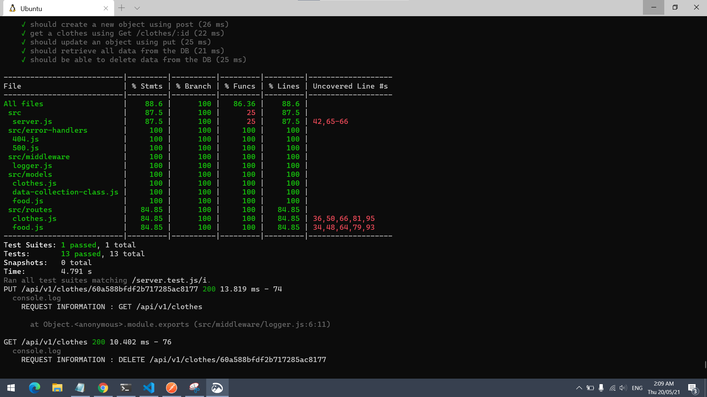

# api-server

# basic-express-server

[The main heroku link](https://yasmeen-api-server.herokuapp.com/)

[Pull_Request](https://github.com/yasmeenokh/api-server/pull/1)

[The Repo Link](https://github.com/yasmeenokh/api-server)

[GitHub Actions](https://github.com/yasmeenokh/api-server/actions)

## Install
Clone the repository from GitHub
Run the command npm i dotenv express jest supertest mongos morgan @code-fellows/supergoose to install dependencies
create .env file with PORT variable
## Test
Run the command npm test to test and verify the server and the logger middleware  are working.
Run the command npm run test for testing .

## Test image : 

## Run
Start the server using nodemon/npm start
Visit http://localhost:PORT at the PORT number you've assigned in your .env

## Routes
* https://yasmeen-api-server.herokuapp.com/bad
* https://yasmeen-api-server.herokuapp.com/foo
* https://yasmeen-api-server.herokuapp.com/api/v1/food
* https://yasmeen-api-server.herokuapp.com/api/v1/clothes

## UML Diagram

<!--  -->
